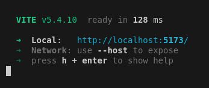

# Northcoders News: Front-End Project

The Northcoders News project is the front-end built on top of my [Northcoders News backend](https://github.com/Pato2763/be-nc-news). The aim of the project was to build a reddit style interface which displays articles and allows the user to sort the articles vote on them as well as post and delete comments. This was done as a part of my personal development as a software developer with Northcoders. The hosted application can be found [here](https://astounding-begonia-569597.netlify.app/).

**To complete this project I had to:**

- Plan a React app, including consideration of state management and component design.
- Implement features to a front end application based on user stories.
- Fetch data from an external API and using it to hydrate your components.
- Implement routing.
- Provide users feedback based on potential errors.
- Build a user interface that considers user experience and accessibility.
- Apply styling to a front end application.
- Deploy a front end project.

## How to Install and run

The minimum specifaction for node to run this project is `node.js v22.6.0`.

Fork this repository and then copy the url. open your terminal and once inside the directory you wish to clone this project run:

```
git clone <Forked repository's url here>
```

Once the repo is cloned onto your local device cd into the repo and run:

```
npm install
```

to local host the application run:

```
npm run dev
```

This should be displayed in the terminal:



By holding Ctrl on windows or cmd on mac and clicking the link the application will open in your browser. To disconnect from the loacl host use Ctrl+c or q

---

This portfolio project was created as part of a Digital Skills Bootcamp in Software Engineering provided by [Northcoders](https://northcoders.com/)
